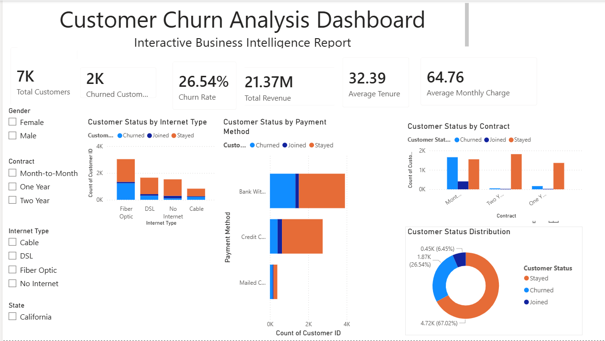
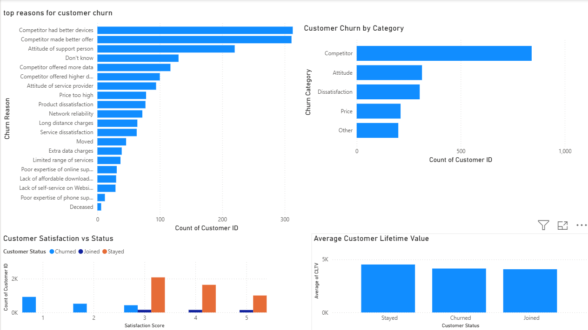

# 📊 Customer Churn Analysis Dashboard

An end-to-end Data Analytics project that analyzes customer churn behavior using Python, SQL, and Power BI. The objective is to identify the key factors influencing customer churn and provide actionable business insights to improve customer retention.

---

## 🎯 Project Objectives

- Analyze customer churn patterns.
- Identify key factors contributing to customer churn.
- Build interactive Power BI dashboards.
- Generate business insights and recommendations.
- Demonstrate an end-to-end data analytics workflow.

---

## 🛠️ Tools & Technologies

- Python
- SQL
- Power BI
- Pandas
- NumPy
- Matplotlib
- Seaborn
- Jupyter Notebook
- VS Code
- GitHub

---

## 📂 Dataset

**Dataset:** Telco Customer Churn Dataset (Kaggle)

The dataset contains customer demographic information, contract details, internet services, payment methods, customer satisfaction scores, revenue, tenure, and churn information.

---

## 📈 Project Workflow

1. Data Cleaning
2. Exploratory Data Analysis (EDA)
3. SQL Business Queries
4. Interactive Power BI Dashboard
5. Business Insights
6. Business Recommendations

---

# 📸 Dashboard Preview

## Executive Dashboard



---

## Churn Analysis Dashboard



---

## 📊 Dashboard Features

### Executive Dashboard

- Total Customers
- Churned Customers
- Churn Rate
- Total Revenue
- Average Monthly Charge
- Average Tenure
- Customer Status Distribution
- Contract Analysis
- Internet Type Analysis
- Payment Method Analysis
- Interactive Slicers

### Churn Analysis Dashboard

- Churn Category Analysis
- Top Churn Reasons
- Customer Satisfaction Analysis
- Customer Lifetime Value (CLTV)
- Business Recommendations

---

## 📌 Key Business Insights

- Approximately **26.54%** of customers have churned.
- Customers with **Month-to-Month** contracts have the highest churn.
- Competitor-related reasons are the leading cause of customer churn.
- Fiber Optic customers exhibit relatively higher churn.
- Lower customer satisfaction scores are strongly associated with churn.
- Customers who remain with the company generate higher Customer Lifetime Value (CLTV).

---

## 💡 Business Recommendations

- Encourage customers to switch to long-term contracts.
- Improve retention strategies against competitors.
- Enhance customer support for dissatisfied customers.
- Reward loyal customers through loyalty programs.
- Develop predictive churn models using Machine Learning.

---

## 📁 Project Structure

```text
Customer-Churn-Analysis/
│
├── dataset/
│   └── Customer_Churn.csv
│
├── Python Analysis/
│   └── Customer_Churn_Analysis.ipynb
│
├── SQL Queries/
│   └── customer_churn_queries.sql
│
├── Power BI Dashboard/
│   └── Customer_Churn_Dashboard.pbix
│
├── Screenshots/
│   ├── executive-dashboard.png
│   └── churn-analysis.png
│
├── Business_Recommendations.md
├── business insights.md
├── README.md
└── requirements.txt
```

---

## 🚀 Future Improvements

- Build a Machine Learning model to predict customer churn.
- Deploy dashboards using Power BI Service.
- Create automated data refresh pipelines.
- Integrate real-time customer data for continuous monitoring.

---

## 👨‍💻 Author

**Muhammad Ali**

B.Tech Computer Science Engineering

**Skills:** Python • SQL • Power BI • Data Analytics

GitHub: https://github.com/alimuhammad-tech
